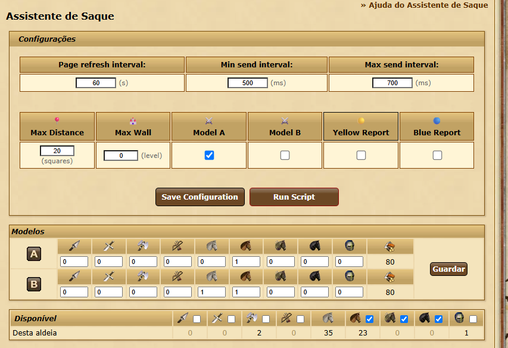

# Tribal Wars Farm Script

**Script para assistente de saque** – Automatização de farming. Este script ajuda jogadores a gerenciar saques disponíveis de forma eficiente, permitindo ataques automáticos com base em critérios configuráveis.


---

## Features

### ✅ Implementado
- **Clique automático nos saques disponíveis**: Identifica e envia ataques automaticamente para aldeias disponíveis.

- **Configurações personalizáveis**:
  - Temporizador de refresh da página
  - Seleção de tipos de saques (A, B)
  - Escolha de atacar relatórios amarelos
  - Escolha de atacar relatórios azuis
  - Limite de distância (em blocos)
  - Limite máximo de muralha
  - Intervalo aleatório de envio (mínimo e máximo)
  - Interface limpa e similar ao jogo para facilitar uso

- **Auto-refresh da página**: Atualiza a página automaticamente após um intervalo configurável.

- **Envio seletivo de ataques**:
  - Somente opção **A**
  - Somente opção **B**
  - Ambas as opções de saque
- **Filtragem por cor de relatório**:
  - Farm apenas relatórios verdes (seguro)
  - Farm amarelos e azuis opcional (configurável)


- **Checks e restrições**:
  - Limite máximo de muralha
  - Limite máximo de distância
  - Unidades disponiveis para cada ataque
  - Ataques enviados em um intervalo tempo com ruído

### 🚧 A implementar
. . . . . . . . . . . . . . . . 

. . . . . . . . . . . . . . . . 

. . . . . . . . . . . . . . . . 

### 📚 Como Usar

1. **Instalar Tampermonkey**  
   Certifique-se de ter a extensão [Tampermonkey](https://www.tampermonkey.net/) instalada 
2. **Adicionar um Novo Script**  
   - Painel do Tampermonkey  
   - Adicionar novo script

3. **Copiar o Script**  
   - Cole o conteúdo do ficheiro do script no editor do Tampermonkey  
   - Salve as alterações

4. **Adaptar para Outros Servidores**  
   Se quiser usar o script em servidores diferentes do PT:  
   - Localize as linhas 7 e 8 do script:  
     ```javascript
     // @match        https://pt*.tribalwars.com.pt/game.php?village=*&screen=am_farm
     // @match        https://pt*.tribalwars.com.pt/game.php?screen=am_farm&village=*
     ```
   - Substitua `pt*.tribalwars.com.pt` pelo domínio do servidor que deseja usar
   
   **Exemplo:**
    ```javascript
    // @match         https://cs106.divokekmeny.cz/game.php?village=*&screen=am_farm
    // @match         https://cs106.divokekmeny.cz/game.php?screen=am_farm&village=*
    ```
